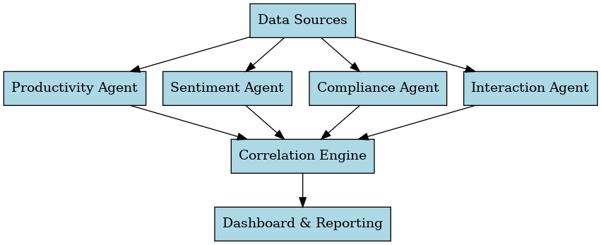

# Multi-AI Agent System Architecture

This repository contains the architecture, methodology, and computational framework for a **Multi-AI Agent System** designed to evaluate and enhance productivity, sentiment, compliance, and collaboration in remote work environments.

## 📌 Overview
The Multi-AI Agent System integrates multiple specialized AI modules that process diverse workplace data sources, producing actionable metrics and correlations. This approach is tailored for research and applied analytics in the tech industry.

## 🏗 Architecture Diagram


## ⚙ Components

### 1. **Productivity Agent**
- **Purpose:** Measures task completion rates from project/task management data.
- **Formula:**
```math
TCR = \left(\frac{Tasks_{Completed}}{Tasks_{Assigned}}\right) \times 100
```
- **Metric:** Task Completion Ratio (%)

### 2. **Sentiment Agent**
- **Purpose:** Analyzes communication sentiment using NLP models.
- **Formula:**
```math
SPI = \frac{\sum Sentiment_{Score}}{n}
```
- **Metric:** Sentiment Polarity Index (-1 to +1)

### 3. **Compliance Agent**
- **Purpose:** Tracks adherence to monitoring disclosures and policy acknowledgments.
- **Formula:**
```math
DCR = \left(\frac{Acknowledgements}{Total_{Sessions}}\right) \times 100
```
- **Metric:** Disclosure Compliance Rate (%)

### 4. **Interaction Agent**
- **Purpose:** Measures collaboration and engagement in communications.
- **Formula:**
```math
CI = \frac{Replies}{Total_{Messages}}
```
- **Metric:** Collaboration Index (0 to 1)

### 5. **Correlation Engine**
- **Purpose:** Analyzes relationships between agent metrics and workplace outcomes.
- **Formula:**
```math
OCS = R^2(Metrics, Outcome)
```
- **Metric:** Outcome Correlation Score (0 to 1)

## 📊 Example Metrics Table
| Agent           | Metric  | Example Value |
|-----------------|---------|---------------|
| Productivity    | TCR     | 82%           |
| Sentiment       | SPI     | 0.45          |
| Compliance      | DCR     | 78%           |
| Interaction     | CI      | 0.64          |
| Correlation     | OCS     | 0.81          |

## 🛠 Tech Stack
- **Language:** Python 3.11+
- **Libraries:** Pandas, NumPy, Scikit-learn, Hugging Face Transformers, Matplotlib, Graphviz
- **Database:** PostgreSQL or MongoDB
- **Visualization:** Plotly Dash

---

## 🧩 Setup Instructions

### 1. Clone Repository
```bash
git clone https://github.com/your-username/Multi-AI-Agent-Monitoring-System.git
cd Multi-AI-Agent-Monitoring-System
```

### 2. Create a Virtual Environment
```bash
python3 -m venv venv
source venv/bin/activate    # On Linux/Mac
venv\Scripts\activate       # On Windows
```

### 3. Install Dependencies
```bash
pip install -r requirements.txt
```

### 4. Run Example
```bash
python main.py
```

---

## 📄 License
This project is open-sourced under the MIT License.
